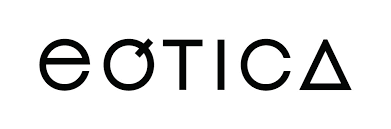

    

 

## Teste técnico - eótica
## Desenvolva API REST e GraphQL, utilizando PHP Laravel.

## Descrição:
* Com os métodos <strong>(Obrigatorios):</strong>
- [✅] POST /products -Recebe um JSON com os atributos e cadastra o produto
- [✅] GET /product/{id} - Retorna o produto pelo id
- [✅] GET /products - Retorna a lista de todos os produtos
- [✅] PUT /product/{id} - Recebe um JSON com os atributos a serem atualizados
- [✅] DELETE /product/{id} - Remove o produto pelo id
* Não obrigatórios:
- [✅] POST /graphql - Deve aceitar uma Mutation para criar um novo
produto. 
- [✅] Deve aceitar uma Query para retornar um produto baseado nos parâmetros.

* [✅] Projeto conter um Dockerfile preparado para subir a API em um cluster Kubernetes.

## Features adicionais:
- [✅] Todo o CRUD feito com GraphQL tambem
- [✅] Testes de Feature GraphQL
- [✅] Testes de Feature REST

## Design Patterns, SOLID & Clean Code
- [✅] Separação das responsabilidades em camadas (Single Responsability).
- [✅] Utilização de Form Request para validação de parâmetros obrigatórios.
- [✅] Utilização dos Códigos HTTP corretamente.
- [✅] Service & Repository Layers
- [✅] Metodologia KISS (Keep it Simple, and Stupid!)
- [✅] Fallback Route

# Rodando projeto
- Clone o projeto
- Rode `docker-compose up -d --build`
- Acesse `docker exec -it graphql-rest_laravel-app_1 bash`
- `php artisan migrate`
- `php artisan db:seed`

# Rodando os testes:
- `php artisan test`
